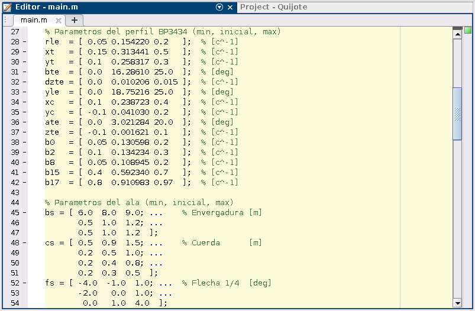
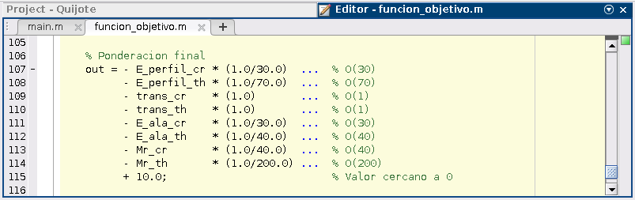
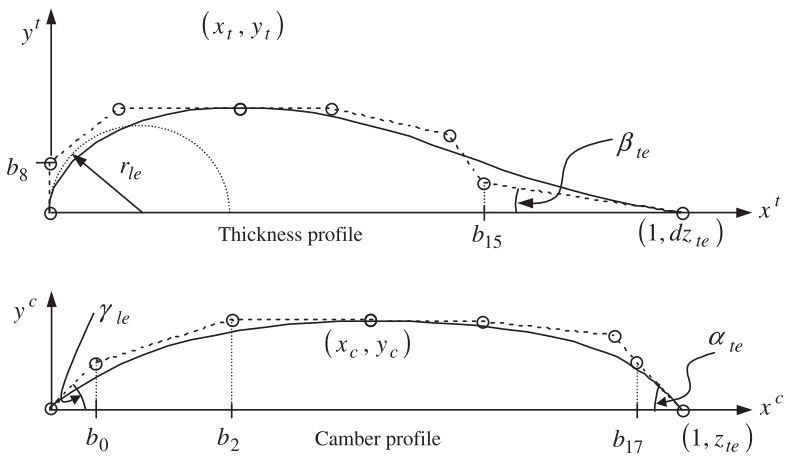
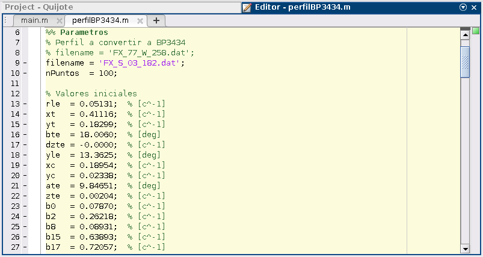

# Quijote
Scripts para el diseño del MAD-1 "Rocinante"

## Tareas pendientes

* Parametrizar posbiles condiciones iniciales
* Ajustar límites de los parámetros
* Obtener perfil final para ajustar manualmente

## Setup

Es recomendable crear un proyecto de Matlab para mantener todos los
archivos organizados
<https://es.mathworks.com/help/matlab/matlab_prog/create-projects.html>,
recordando añadir todas las carpetas al `PATH`.

Para que `Xfoil` funcione es necesario que el archivo `xfoil.exe` este en
la carpeta `Perfil/Xfoil`. Si tenéis Linux o Mac podéis crear un enlace
al ejecutable usando los comandos siguientes desde la carpeta `Xfoil`:

* Para saber donde esta el ejecutable: `type xfoil`
* Para crear el enlace: `ln -s /direccion/de/xfoil`

## Quick-start del optimizador

Para iniciar la optimización es necesario especificar el perfil y el ala
iniciales al comienzo del archivo `main.m`. También es posible cambiar otros
parámetros, aunque con los que hay ahora mismo ya debería funcionar.

Los valores mínimos y máximos tienen bastante importancia y, si no se eligen
bien, es posible que el programa no consiga encontrar ninguna solución.

Durante la ejecución, el programa trata de minimizar el valor de la función
definida en `funcion_objetivo.m`. Obviamente, el resultado de todo el proceso
depende de cómo se defina esta función, así que diferentes funciones y
condiciones iniciales dan lugar a diferentes soluciones finales.

## Utilidad de parametrización BP3434

A pesar de que la forma inicial del perfil debe introducirse en el programa
a través de una parametrización llamada BP3434, normalmente los perfiles están
definidos mediante archivos de texto con las coordenadas del perfil. Esta
parametrización se ha escogido por simplificar el proceso de optimización de
perfiles sin limitar en exceso la precisión, y sigue la formulación descrita en
[Derksen, R. W., & Rogalsky, T. (2010). Bezier-PARSEC: An optimized aerofoil
parameterization for design](https://doi.org/10.1016/j.advengsoft.2010.05.002),
donde los perfiles se describen mediante los 15 parámetros de la siguiente
imagen:

Para encontrar los valores de estos parámetros se puede usar el archivo
`perfilBP3434.m`, siguiendo estos pasos:

1. Poner el archivo con las coordenadas del perfil en `Utilidades/` (hay
   ejemplos de archivos en la carpeta `Extra/`).
2. Indicar en `perfilBP3434.m` el nombre del archivo con las coordenadas del
   perfil.

La función puede ejecutarse como un programa independiente o como una función
que devuelve los valores BP3434 correspondientes al perfil. Las condiciones
iniciales también pueden cambiarse, y es recomendable ajustarlas de manera que
el perfil inicial sea similar al buscado.

## Guía para usar git

Guía "oficial":
<https://github.github.com/training-kit/downloads/github-git-cheat-sheet.pdf>

Normalmente, antes de empezar es bueno actualizar todo

* `git checkout [branch donde vais a trabajar]`
* `git pull`

Una vez que hayáis hecho varios cambios que estén relacionados, haced un
_commit_ con un comentario que los agrupe.

* `git add .`
* `git commit -m "comentario"`

Cuando estéis seguros de que esta todo bien, subid todo al servidor

* `git push`.

### Git cheat sheet

* Actualizar archivos desde el servidor (hacer **siempre** antes de trabajar):
    - `git pull`

* Seleccionar archivos a incluir en el próximo _commit_ (_staged_):
    - `git add [nombre de los archivos]`
    - `git add .` (para añadir todos los cambios)

* Hacer un _commit_:
    - `git commit -m "[comentario que resuma los cambios realizados]"`

* Subir cambios al servidor de **github**:
    - `git push`

* Revisar _commits_ anteriores:
    - `git log`

* Revisar cambios realizados (_staged_ y no):
    - `git status`

* Crear _branch_:
    - `git branch [nombre de branch]`

* Cambiar a otra _branch_:
    - `git checkout [nombre de branch]`

* Unir _branch_ a _master_ (_merge_):
    - `git merge [branch a unir]` (estando en _master_)
